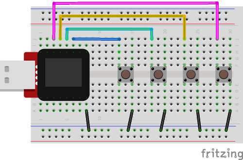

# Conway's Game of Life for the MicroView (Arduino)

By Scott Allen

## Description

An implementation of Conway's Game of Life, a cellular automation, for the GeekAmmo/SparkFun MicroView.

[Conway's Life on Wikipedia](http://en.wikipedia.org/wiki/Conway%27s_Game_of_Life)

Each pixel is a cell. Only the torus type finite grid is implemented (the left edge joins to the right edge and top edge joins to the bottom edge).

## Usage

Although it will run with no additional components, it's best to have at least one push-button, which starts a new game with a random pattern. Three additional push-buttons are supported to decrease the speed, increase the speed, and replay the game with the same starting pattern. With no buttons attached it just uses the start-up text as the starting pattern (which turns out to be a pretty good one).

Push-buttons are of the normally open type. Each is wired between an I/O pin and ground. The assignment of the buttons (which can be changed by modifying the constants near the start of the code) is as follows:

Pin | Function
--- | --------
2   | Start a new game
3   | Restart with the same pattern
5   | Decrease the speed
6   | Increase the speed

Note that the Restart button will not work for the initial screen. A different pattern will be generated.

### Breadboard example

## Required Libraries

[MicroView.h](https://github.com/geekammo/MicroView-Arduino-Library)

## License

Copyright (c) 2014 Scott Allen

Permission is hereby granted, free of charge, to any person obtaining a copy
of this software and associated documentation files (the "Software"), to deal
in the Software without restriction, including without limitation the rights
to use, copy, modify, merge, publish, distribute, sublicense, and/or sell
copies of the Software, and to permit persons to whom the Software is
furnished to do so, subject to the following conditions:

The above copyright notice and this permission notice shall be included in
all copies or substantial portions of the Software.

THE SOFTWARE IS PROVIDED "AS IS", WITHOUT WARRANTY OF ANY KIND, EXPRESS OR
IMPLIED, INCLUDING BUT NOT LIMITED TO THE WARRANTIES OF MERCHANTABILITY,
FITNESS FOR A PARTICULAR PURPOSE AND NONINFRINGEMENT. IN NO EVENT SHALL THE
AUTHORS OR COPYRIGHT HOLDERS BE LIABLE FOR ANY CLAIM, DAMAGES OR OTHER
LIABILITY, WHETHER IN AN ACTION OF CONTRACT, TORT OR OTHERWISE, ARISING FROM,
OUT OF OR IN CONNECTION WITH THE SOFTWARE OR THE USE OR OTHER DEALINGS IN
THE SOFTWARE.

